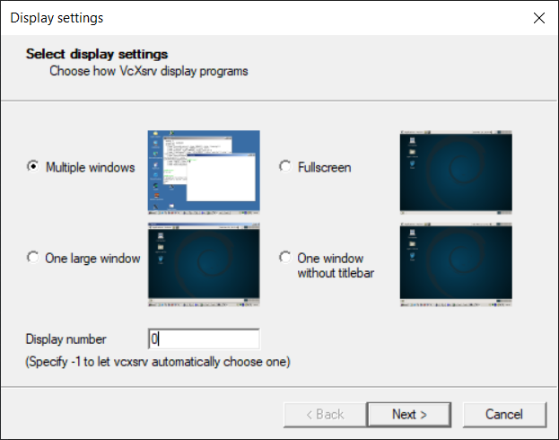
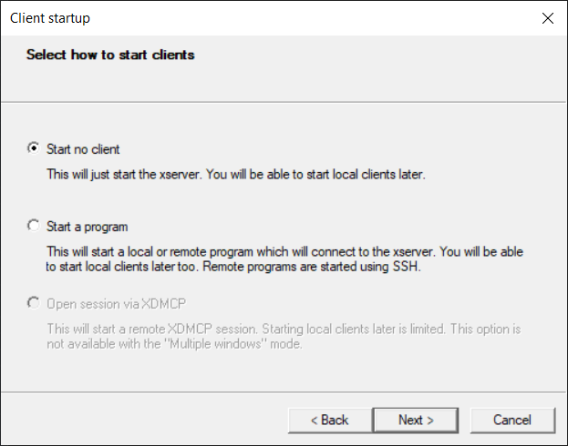
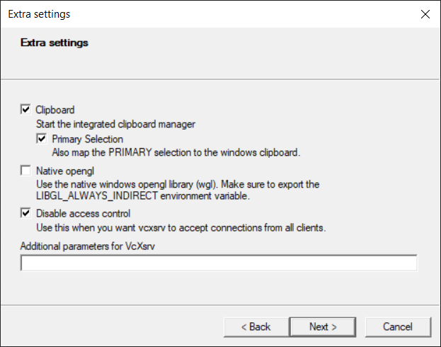

# hexacopter-env

Dockerfile to setup a ROS2 Foxy Linux environment for working on the AutonomousHexacopter project. Prebuilt images available on the [UGA Robotics Docker Hub](https://hub.docker.com/orgs/ugarobotics) page.

## Prerequisites

### Install Docker

Follow the instructions for your operating system to install Docker:

1. [Linux](https://docs.docker.com/engine/install/)
2. [Windows](https://docs.docker.com/docker-for-windows/install/)
3. [MacOS](https://docs.docker.com/docker-for-mac/install/)

Make sure to test your Docker install with the instructions provided.

### Special Directions for Windows

When installing Docker for Windows, **make sure to install the WSL (Windows Subsystem for Linux) 2 backend as directed**, as we'll need WSL 2 to build/use Linux containers, and use Docker in a preffered, unified way (WSL makes it such that Windows, Linux, and MacOS systems can use the same commands/interface). 

When you have the WSL 2 Backend installed correctly, you should then install a Linux Distribution on your Windows machine using the Microsoft Store. This allows you to access the WSL 2 file system with a full operating system, such as Ubuntu. You can [download Ubuntu 20.04 from the Microsoft Store here](https://www.microsoft.com/en-us/p/ubuntu-2004-lts/9n6svws3rx71?activetab=pivot:overviewtab).

In addition to installing and enabling the WSL 2 backend as directed in the Windows installation instructions, you'll also need to enable this functionality in Docker Desktop using this guide on [The Docker Desktop WSL 2 Backend](https://docs.docker.com/docker-for-windows/wsl/#download), Which goes over installation (already covered) and configuration of WSL 2 for use with Docker. The guide has you using the Windows terminal, which can be accessed by opening up PowerShell from the start menu. Make sure to set the default Linux distribution and version in WSL as directed (the name is `Ubuntu-20.04`), and enable the distribution in the Docker Desktop 'WSL Integration' menu in the Resources tab of the settings.

When you have your WSL 2 Linux Distribution setup, launch it for the first time using the start menu (Search 'Ubuntu' and it should come up, you can even pin it to your taskbar) and [do the typical first-time git setup](https://git-scm.com/book/en/v2/Getting-Started-First-Time-Git-Setup). Also, [generate and add an ssh key in Linux and add it to your GitHub account](https://docs.github.com/en/github/authenticating-to-github/generating-a-new-ssh-key-and-adding-it-to-the-ssh-agent), as we'll need to use it shortly.

After that, in WSL 2, execute the following commands to setup WSL for X11 forwarding and to fix some issues with conflicts between X11 forwarding and SSH:
```bash
echo "export DISPLAY=$(awk '/nameserver / {print $2; exit}' /etc/resolv.conf 2>/dev/null):0" >> ~/.bashrc
echo "export LIBGL_ALWAYS_INDIRECT=0" >> ~/.bashrc
echo "echo 'nameserver 8.8.8.8' | sudo tee -a /etc/resolv.conf > /dev/null" >> ~/.bashrc
echo "echo 'nameserver 8.8.4.4' | sudo tee -a /etc/resolv.conf > /dev/null" >> ~/.bashrc
```

Finally, you'll need to download and setup [VcXsrv](https://sourceforge.net/projects/vcxsrv/), a Windows XServer, needed to view Gazebo on Windows through WSL 2. Go through the installation instructions to your preferences, and use the `XLaunch` program to configure the Xserver as such:







Now you should be good to go for a basic Docker setup on WSL 2 on Windows. If you have an Nvidia GPU in your computer, and you would like to get better performance in Gazebo, you can follow the [steps in this guide](https://docs.microsoft.com/en-us/windows/win32/direct3d12/gpu-cuda-in-wsl) to enable Nvidia GPU support in WSL 2. You can use your UGA Mail outlook login to register for the Insider Program.
 
### Add SSH Key to SSH Agent

In order to pass our SSH keys to the Docker Container for use while we work, we'll need to add our SSH key to the SSH Agent, which provides your SSH Key to applications as a service. First, [ensure you have an SSH, and that it is connected to your GitHub account](https://docs.github.com/en/github/authenticating-to-github/generating-a-new-ssh-key-and-adding-it-to-the-ssh-agent). 

Next, in your terminal (WSL if on Windows), make sure an SSH Agent process is running by entering the following command:
```
eval "$(ssh-agent -s)"
```

It should return the PID (Process ID) of the agent and exit.

When that is running, execute the command:
```
ssh-add /path/to/key
```

Where `/path/to/key` is the path to your private SSH Key generated previously. This is typically something like `~/.ssh/id_rsa` or `~/.ssh/id_ed25519` if you followed the instructions provided.

## Running the Docker Container

Even if you don't wish to build the Docker image on your local machine, you should download the `hexacopter-env` repository as it contains a particularly useful script for running the docker container with all of the required options set for you. Simply navigate to the repository page [here](https://github.com/uga-robotics/hexacopter-env) and download it to your local machine using `git clone` (within WSL if you are on Windows).

You'll also need to download the [`AutonomousHexacopter`](git@github.com:uga-robotics/AutonomousHexacopter.git) repository in the same manner to your machine, placing it in ROS2 Workspace directory with this structure:
```
├── devel_ws
│   └── src
│       └── AutonomousHexacopter
```
Where `devel_ws` is the 'root' directory of the workspace. While in `devel_ws`, execute `pwd` from the command line, and copy the path given.

Next, we'll download the Docker image we need from the [UGA Robotics Docker Hub page](https://hub.docker.com/orgs/ugarobotics). Simply navigate to the `hexacopter-env` repository, go to the `tags` menu, and copy command to the right of the image you would like to use. The command should look something like:
```
docker pull ugarobotics/hexacopter-env:TAG
```

Let the download finish and you can move to the next step.

Now, navigate back to the `hexacopter-env` repository, and execute the `launch_wsl.sh` script if you're using WSL on Windows, and execute `launch_unix.sh`if you're using Linux or MacOS natively. You should execute your given script as such:
```
./scripts/launch_<platform>.sh -p /path/to/workspace/root -i <ImageID>
```

Where `/path/to/workspace/root` is the path you copied, and `<ImageID>` is the Docker Hub image you would like to run (the one we pulled earlier!). To see a list of available Docker images, use the `docker images`
command.

You should then be taken into the Docker container, and dropped into a command prompt. You can exit the container at any time by entering the `exit` command. Otherwise, the container acts just like a regular Ubuntu installation.

If you would like to connect additional terminal windows to the Docker container, you can open up another terminal window, and search for the container id by entering `docker ps -a`.

Copy the container ID shown and use it in the following command to connect a terminal:
```
docker exec -it <containerID> bash
```

## Building the Docker Image on Your Local Machine

If you wish, you are free to build the Docker image and run it on your machine. To do this, you should clone this repository (`hexacopter-env`) into WSL if you're on Windows or anywhere on your machine if you're on MacOS or Linux. Simply copy the SSH address and execute `git clone` with it.

After that is done, you now have the `hexacopter-env` repository on your computer, with the Dockerfile included. Navigate into the `hexacopter-env` directory and execute the following command:
```
docker build .
```

After the container finishes building (should take 10-20 minutes depending on your computer), you can run it with the same script as suggested above.
```

## Final Thoughts

Now that you're up and running with the `hexacopter-env` Docker container, you'll be able to run, test, debug, and otherwise contribute to code used in the `AutonomousHexacopter` project from anywhere, without have to have a separate, difficult to maintain Linux installation.

As we push changes to the Dockerfile when needed, we will tag the releases on Docker Hub, with the latest release being the highest tag number.
